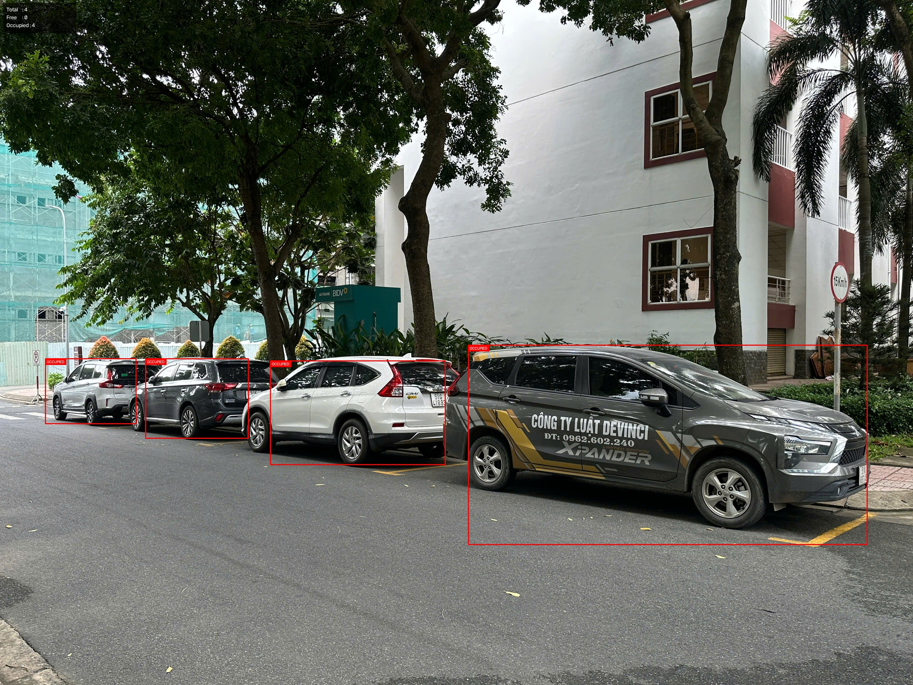
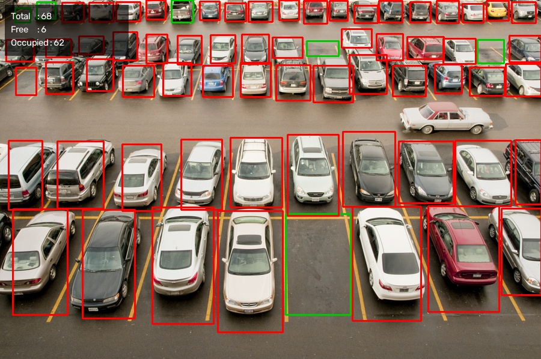

# Smart Parking Occupancy Detection

A senior project that detects whether predefined parking spaces are **free** or **occupied** using deep learning and computer vision. The project compares CNN-based parking-space classification with pretrained YOLO11 vehicle detection and ROI-based occupancy analysis, then integrates the selected approach into a multi-camera desktop application.

## Project Overview

Camera-based parking monitoring can observe multiple parking spaces without installing a physical sensor in every space. This project investigates two approaches:

1. **CNN-based occupancy classification** — classifies cropped parking-space images as free or occupied.
2. **Pretrained YOLO11 with ROI analysis** — detects vehicles in an image or video and matches them with manually defined parking-space regions.

The YOLO11–ROI approach is also integrated into a PyQt5 application that supports up to three image or video sources and displays the occupancy status of each camera in real time.

## Main Features

- CNRPark+EXT and PKLot dataset preparation
- CNN training for binary parking-space classification
- Five-fold cross-validation and test-set evaluation
- External-image evaluation for the final CNN model
- Pretrained YOLO11 vehicle detection
- Manual polygon ROI configuration
- Image and video occupancy analysis
- Manual ground-truth comparison
- Three-camera PyQt5 monitoring application
- Per-camera and overall free/occupied counters

## Occupancy Decision

For the YOLO11–ROI method, a parking space is marked as occupied when either:

- the bottom-center point of a detected vehicle lies inside the parking ROI; or
- the overlap between the vehicle bounding box and the ROI reaches the configured threshold.

Otherwise, the parking space is marked as free.

## Repository Structure

```text
smart-parking-occupancy-detection/
├── app/
│   └── app_newversion.py
├── demo/
│   └── config/
│       ├── cam1_slots.json
│       ├── cam2_slots.json
│       └── cam3_slots.json
├── src/
│   ├── data/
│   │   ├── check_dataset.py
│   │   ├── parking_dataset.py
│   │   ├── prepare_dataset.py
│   │   └── prepare_pklot.py
│   ├── evaluation/
│   │   ├── analyze_5fold_results.py
│   │   └── test_final_cnn_external.py
│   ├── inference/
│   │   └── cnn_classifier.py
│   ├── models/
│   ├── training/
│   │   ├── 5fold_with_test.py
│   │   └── train_final_cnn.py
│   └── yolo_detect/
│       ├── demo_parking_roi_v3.py
│       └── setup_roi_folder.py
├── crop_cnn_external.py
├── evaluate_manual_vs_model.py
├── requirements.txt
└── README.md
```

Large datasets, trained model weights, videos, virtual environments, and generated outputs are not included in the repository.

## Datasets

The project uses:

- **CNRPark+EXT** for CNN-based parking-space classification
- **PKLot** for comparison and experimental evaluation
- Locally captured parking videos for the multi-camera application demo
- A small set of external images for qualitative testing

Download and prepare the datasets separately before training. The expected processed CSV files are stored under:

```text
data/processed/train.csv
data/processed/val.csv
data/processed/test.csv
```

## Technologies

- Python 3.11
- PyTorch and Torchvision
- Ultralytics YOLO
- OpenCV
- PyQt5
- NumPy and Pandas
- Scikit-learn
- Matplotlib and Seaborn
- Pillow

## Installation

Clone the repository:

```bash
git clone https://github.com/phucbaotran/smart-parking-occupancy-detection.git
cd smart-parking-occupancy-detection
```

Create and activate a virtual environment on Windows:

```powershell
py -3.11 -m venv venv_gpu
.\venv_gpu\Scripts\Activate.ps1
```

Install the dependencies:

```powershell
pip install -r requirements.txt
```

Model weights such as `yolo11n.pt`, `yolo11s.pt`, and the trained CNN checkpoint must be downloaded or placed locally because they are excluded from Git.

## Usage

### Prepare the CNN dataset

```powershell
python src/data/prepare_dataset.py
```

### Run five-fold evaluation

```powershell
python src/training/5fold_with_test.py
```

### Train the final CNN model

```powershell
python src/training/train_final_cnn.py
```

### Configure parking-space ROIs

```powershell
python src/yolo_detect/setup_roi_folder.py
```

### Run YOLO11 with ROI analysis

```powershell
python src/yolo_detect/demo_parking_roi_v3.py
```

### Run the multi-camera application

```powershell
python app/app_newversion.py
```

The local paths and model settings may need to be selected or configured before running the application on a new machine.

## Example Results

### Locally collected parking image



### External parking image



## Limitations

- Parking-space ROIs are configured manually and depend on a mostly fixed camera viewpoint.
- Camera movement can shift the ROIs and reduce occupancy accuracy.
- Small or partially occluded vehicles may be missed.
- Objects with vehicle-like visual features may occasionally cause false detections.
- Performance can be affected by lighting, weather, shadows, viewing angle, and video quality.
- Dataset files, large videos, and trained weights are not distributed in this repository.

## Future Work

- Add automatic parking-space localization
- Improve robustness to camera movement
- Test nighttime and more difficult weather conditions
- Optimize inference speed for live camera streams
- Support additional cameras and network camera sources
- Improve deployment and long-term parking-status storage

## Author

**Tran Bao Phuc**
Electrical and Telecommunication Engineering Student

This repository was developed as an individual senior project and portfolio project in deep learning and computer vision.

